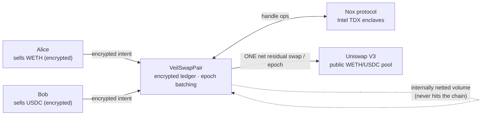

# VeilSwap

**Dark-pool privacy on public liquidity.** VeilSwap is a confidential swap and
payment layer built on [iExec Nox](https://docs.noxprotocol.io) confidential
smart contracts. Deposit WETH or USDC and your activity disappears: balances
become encrypted handles, swap intents hide their **direction, size and limit**
inside Intel TDX enclaves, and opposing flow is netted entirely off the public
market. Each epoch, only the net residual executes as **one aggregate swap** on
the real, unmodified Uniswap V3 pool on Ethereum Sepolia.

Observers see a contract trade with Uniswap once per epoch. They never see who
traded, how much, or which way — and volume that nets internally never touches
the public chain at all. Encrypted balances double as a private payment rail
(hidden-amount transfers), and withdrawals can exit to any fresh address,
severing the deposit → withdrawal link. The protocol is **ownerless**: epoch
settlement is permissionless, the reference price is read from the pool itself,
and every decrypted value carries a Nox proof verified on-chain. A keeper adds
liveness, never authority.



## How the privacy works

1. **Encrypted state** — balances, intent fields and escrows are Nox handles
   (`euint256`/`ebool`). Plaintext exists only inside attested TDX enclaves and
   in the owner's browser.
2. **Batching + netting** — each epoch's intents are eligibility-checked and
   summed *in the encrypted domain*. Opposing flow cross-fills internally at
   the epoch price; only two aggregate side totals are ever revealed (with
   on-chain verified decryption proofs), because the residual swap needs a
   plaintext size.
3. **k-anonymity** — an observer learns only "k intents; these side totals".
   Every participant hides among the k submitters, and per-intent `minOut` is
   still enforced exactly via the shared worst-case bound used as the Uniswap
   `amountOutMinimum`. Privacy scales with batch size — see the full
   [threat model](docs/ARCHITECTURE.md#threat-model--what-is-hidden-from-whom).

## Repository layout

```
contracts/   VeilSwapPair + encrypted ledger + pure netting lib (Solidity 0.8.35)
test/        19 tests against a real local Nox stack (TEE runner in Docker)
keeper/      permissionless settlement service (lock → publicDecrypt → settle)
app/         Vite + React + wagmi + RainbowKit dark-pool frontend
scripts/     deploy + ABI export
docs/        ARCHITECTURE.md · DEMO_SCRIPT.md
feedback.md  honest iExec Nox developer-experience feedback (judged deliverable)
```

## Quickstart (fresh clone)

Prereqs: Node 22+, pnpm 9+, Docker running (for the local Nox test stack).

```sh
pnpm install
pnpm compile          # solc 0.8.35, viaIR
pnpm test             # boots the full local Nox stack in Docker — first run pulls images
```

> **Windows note:** the Nox hardhat plugin detects Docker via the
> `docker_engine` named pipe. With Docker Desktop this just works; if your
> Docker engine lives inside WSL, run the tests from a WSL shell instead.

### Frontend

```sh
cd app && pnpm install && pnpm dev     # http://localhost:5173 (Sepolia)
```

### Deploy to Sepolia

```sh
cp .env.example .env                   # fill PRIVATE_KEY, ETHERSCAN_API_KEY
pnpm deploy:sepolia                    # deploys against real Uniswap V3, updates deployments.json
pnpm tsx scripts/export-abi-to-app.ts  # sync ABI + addresses into the app
pnpm hardhat verify --network sepolia <address> <args…>   # printed by the deploy script
```

### Keeper

```sh
# .env: KEEPER_PRIVATE_KEY, VEILSWAP_PAIR_ADDRESS
pnpm keeper:watch      # or keeper:once / the GitHub Action cron (.github/workflows)
```

## Deployed addresses (Ethereum Sepolia)

| Contract | Address |
|---|---|
| VeilSwapPair | _pending deployment_ |
| WETH | [`0xfFf9976782d46CC05630D1f6eBAb18b2324d6B14`](https://sepolia.etherscan.io/address/0xfFf9976782d46CC05630D1f6eBAb18b2324d6B14) |
| USDC | [`0x1c7D4B196Cb0C7B01d743Fbc6116a902379C7238`](https://sepolia.etherscan.io/address/0x1c7D4B196Cb0C7B01d743Fbc6116a902379C7238) |
| Uniswap V3 WETH/USDC 0.05% pool | [`0x3289680dd4d6c10bb19b899729cda5eef58aeff1`](https://sepolia.etherscan.io/address/0x3289680dd4d6c10bb19b899729cda5eef58aeff1) |
| Uniswap SwapRouter02 | [`0x3bFA4769FB09eefC5a80d6E87c3B9C650f7Ae48E`](https://sepolia.etherscan.io/address/0x3bFA4769FB09eefC5a80d6E87c3B9C650f7Ae48E) |
| NoxCompute | [`0x24Ef36Ec5b626D7DCD09a98F3083c2758F0F77bF`](https://sepolia.etherscan.io/address/0x24Ef36Ec5b626D7DCD09a98F3083c2758F0F77bF) |

Machine-readable copy in [`deployments.json`](deployments.json).

## Demo walkthrough (real Sepolia transactions)

Follows [docs/DEMO_SCRIPT.md](docs/DEMO_SCRIPT.md) — hashes recorded from the
end-to-end rehearsal:

| Step | Tx |
|---|---|
| Alice deposits WETH | _pending E2E rehearsal_ |
| Alice's encrypted intent (WETH→USDC) | _pending_ |
| Bob's encrypted intent (USDC→WETH) | _pending_ |
| Epoch lock (eligibility + encrypted sums) | _pending_ |
| **Settlement — ONE aggregate Uniswap swap** | _pending_ |
| Private transfer (hidden amount) | _pending_ |
| Withdrawal to a fresh address | _pending_ |

## Tests

19 tests, all running against the **real** local Nox stack (gateway, KMS, TEE
runner — no mocked encryption): exact netting math to the wei, all-or-nothing
ledger semantics, minOut exclusion + refund, fully-netted epochs (zero public
swaps), empty-epoch rollover, and the cancel escape hatch.

```
19 passing
```
