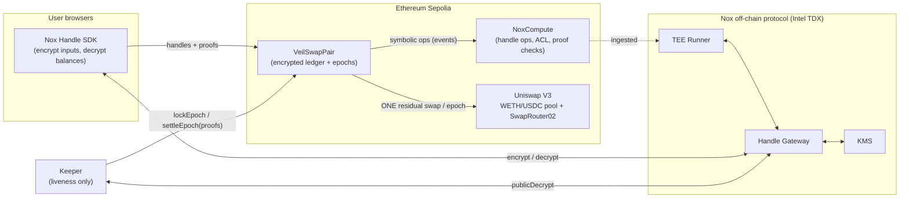
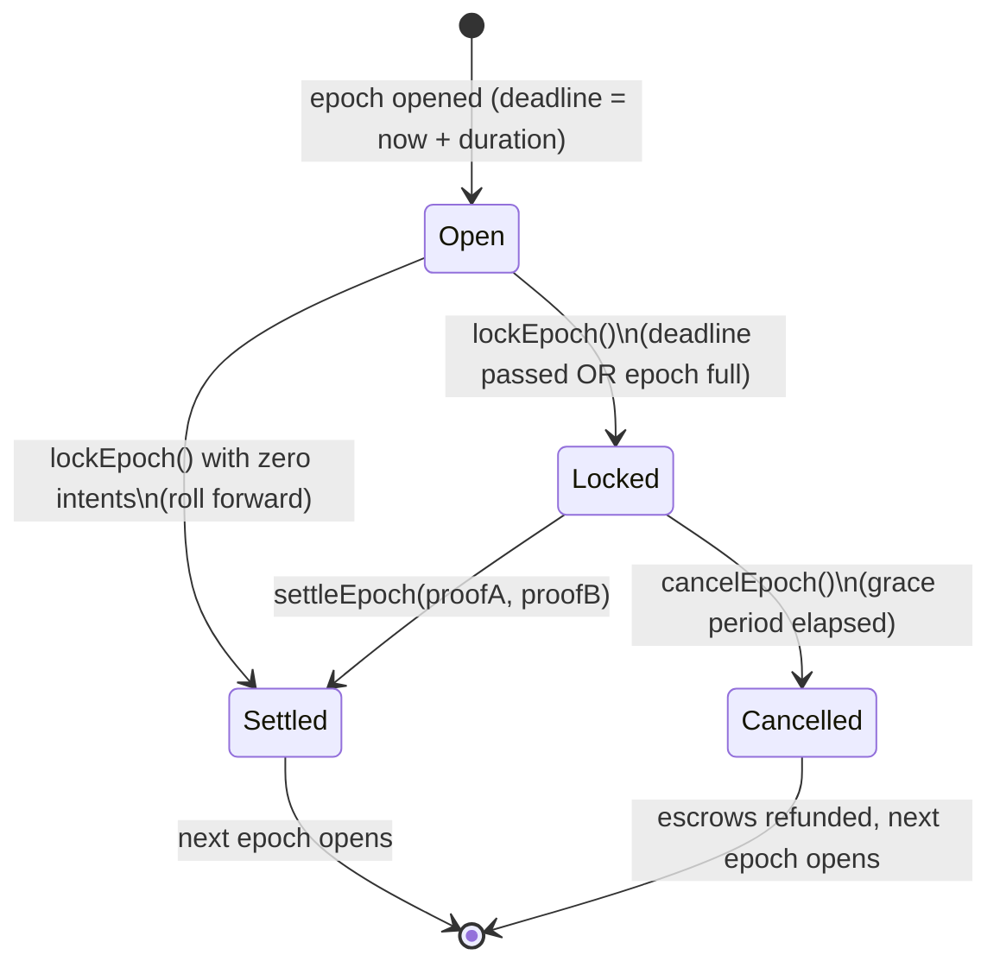

# VeilSwap Architecture

VeilSwap is a confidential batch-swap and payment layer for one token pair
(WETH/USDC on Ethereum Sepolia). It stores user balances as encrypted iExec Nox
handles, collects fully encrypted swap intents, nets opposing flow inside the
encrypted domain each epoch, and executes only the net residual as **one
aggregate swap** against the canonical public Uniswap V3 pool — which is never
modified or forked.

## Components

- **VeilSwapPair** (`contracts/VeilSwapPair.sol` + `VeilSwapBalances.sol`): the
  entire confidential logic is ordinary Solidity over Nox encrypted types
  (`euint256`, `ebool`). There is no custom TEE payload — the Nox Runner
  executes each operation off-chain and the contract chains deterministic
  result handles synchronously.
- **VeilSwapEpochLib**: pure plaintext math (price conversion, netting split,
  worst-case bounds), exhaustively unit-tested without the TEE stack.
- **Keeper** (`keeper/`): a stateless loop that anyone can run. Every function
  it calls is permissionless; every input it supplies is either read from the
  pool on-chain or carries a Nox decryption proof verified by NoxCompute.
- **Frontend** (`app/`): encrypts intent fields client-side through the Handle
  Gateway (attested TDX HTTPS) and decrypts balances locally via KMS
  delegation. Plaintext amounts never transit the dApp's own infrastructure.

## Epoch lifecycle

### 1. Deposit
`deposit(token, amount)` pulls the ERC-20 and credits an encrypted balance.
The deposit amount is the **last public trace** of the user's activity.

### 2. Intent
`submitIntent(eDirection, eAmountIn, eMinOut, proofs…)` — all three fields are
encrypted client-side. Escrow is taken all-or-nothing from the direction's
balance using `select` chains over both balances symmetrically, so neither the
direction nor a shortfall is observable; an underfunded intent silently escrows
an encrypted zero instead of reverting (no balance oracle).

### 3. Lock
`lockEpoch()` (permissionless, once the deadline passes or the epoch is full):

1. Reads the reference price from the Uniswap pool's `slot0` — the keeper
   supplies **no** price input.
2. Computes each intent's worst-case output at `price × (1 − slippageBps)` in
   the encrypted domain, and its eligibility `eMinOut ≤ worstOut`.
3. Ineligible escrows are refunded immediately (as encrypted zeros for eligible
   intents, so the operation pattern is uniform across all intents).
4. Sums eligible inputs per side into `sumAIn`/`sumBIn` and marks both handles
   publicly decryptable.

### 4. Settle
The keeper obtains `(value, proof)` for both sums from the SDK's
`publicDecrypt`, then calls `settleEpoch(proofA, proofB)`:

1. `Nox.publicDecrypt(handle, proof)` verifies each proof **on-chain** against
   NoxCompute and yields the plaintext side totals — the only aggregate values
   ever revealed.
2. `computeSettlement` nets the sides at the lock price. The smaller side is
   filled entirely internally; the residual of the larger side is executed as
   ONE `exactInputSingle` on SwapRouter02 with
   `amountOutMinimum = residual × worstPrice` — the *same* bound used for
   eligibility, which is what carries every included intent's `minOut` through
   to execution:
   - smaller side: fills exactly at the lock price ≥ worst-case ✓
   - larger side: blended internal + external fill ≥ worst-case ✓
3. Payouts are pro-rata in the encrypted domain:
   `out_i = included_i × totalOut / totalIn` (encrypted × plaintext), floored.
   Rounding dust (≤ 1 wei per participant) stays in the contract and can never
   cause an over-allocation.

Perfectly netted epochs skip Uniswap entirely: that volume **never touches the
public chain**.

### 5. Withdraw / transfer
- `requestWithdraw` burns an encrypted amount (all-or-nothing) and marks the
  burnt handle publicly decryptable; `finalizeWithdraw` verifies the proof
  on-chain and releases ERC-20 to **any** recipient, severing the
  deposit → withdraw link.
- `confidentialTransfer` moves encrypted amounts inside the ledger with
  `Nox.transfer` all-or-nothing semantics — a private payment rail for free.

## Settlement math invariants (tested)

With `P` = lock price (tokenB per tokenA, 1e18-scaled), `sumA`/`sumB` the
eligible side totals:

| Case | Internal fill | Residual (→ Uniswap) | Solvency |
|---|---|---|---|
| `sumA·P ≤ sumB` | A-side gets `⌊sumA·P⌋` B; B-side gets `sumA` A | `sumB − ⌊sumA·P⌋` B | tokenB out = sumB exactly |
| `sumA·P > sumB` | A-side gets `sumB` B; B-side gets `⌊sumB/P⌋` A | `sumA − ⌊sumB/P⌋` A | tokenA out = sumA exactly |

All floors favor the contract; user payouts are floors of exact pro-rata
shares, so `Σ payouts ≤ totalOut` always holds.

## Threat model — what is hidden from whom

| Data | Public observer | Other VeilSwap users | Keeper | Nox TEE operators |
|---|---|---|---|---|
| Deposit amount + depositor | visible | visible | visible | visible |
| Encrypted balance | hidden | hidden | hidden | hidden (plaintext exists only inside TDX during ops) |
| Intent existence + submitter | visible | visible | visible | visible |
| Intent direction / size / minOut | **hidden** | **hidden** | **hidden** | inside TEE only |
| Per-epoch eligible side totals | revealed at settlement | revealed | revealed | — |
| Who traded, how much, which way | **hidden** | **hidden** | **hidden** | inside TEE only |
| Internal (netted) volume | only the two side totals | same | same | — |
| Transfer amount | **hidden** | **hidden** | **hidden** | inside TEE only |
| Transfer counterparties | visible (no `eaddress` in Nox yet) | visible | visible | visible |
| Withdrawal amount + recipient | visible at finalize | visible | visible | visible |
| Deposit ↔ withdrawal linkage | **broken** (fresh recipient) | broken | broken | broken |

### Honest limitations

- **k-anonymity scales with batch size.** With `k` intents in an epoch, an
  observer learns only the two aggregate side totals; each user hides among the
  `k` submitters. A single-intent epoch reveals that submitter's side total —
  batching *is* the privacy. Epoch duration / max-intents are the k-vs-latency
  dial.
- **Aggregate side totals are revealed by design** — the residual swap needs a
  plaintext size. Individual contributions remain hidden.
- **Reference price is `slot0` spot** at lock time, sanity-bounded by the 0.5%
  slippage guard on execution. A production deployment should use a TWAP
  observation instead; spot manipulation cost on the demo pool exceeds any
  extractable value bounded by that guard.
- **Rounding**: per-intent fills are exact floors; a marginal intent whose
  `minOut` equals its worst-case bound to the wei can be underpaid by ≤ 1 wei
  relative to the bound. The frontend's suggested `minOut` includes margin.
- **Timing correlation**: submitting an intent and receiving a settlement in
  the same epoch is observable as *membership*, not as content.

## Trust assumptions

- **Keeper: liveness only.** All epoch functions are permissionless; proofs are
  verified on-chain; the price comes from the pool. A malicious keeper can at
  worst *delay* settlement — after `cancelGracePeriod`, anyone can
  `cancelEpoch()` and every escrow is refunded. No admin keys exist anywhere.
- **Nox protocol**: correctness and confidentiality of handle operations rest
  on NoxCompute + the TDX-attested Runner/Gateway/KMS, as documented by the
  [Nox protocol](https://docs.noxprotocol.io/protocol/global-architecture-overview).
- **Uniswap V3**: used unmodified as the public liquidity venue.

## Gas profile (local stack, 2-intent epoch)

| Tx | Gas |
|---|---|
| `submitIntent` | ~575k |
| `lockEpoch` | ~1.09M (≈ 0.5M per intent) |
| `settleEpoch` | ~709k |

`maxIntentsPerEpoch = 8` keeps `lockEpoch` around ~4.3M gas — comfortable on
Sepolia. Raising it is a deploy-time parameter.
